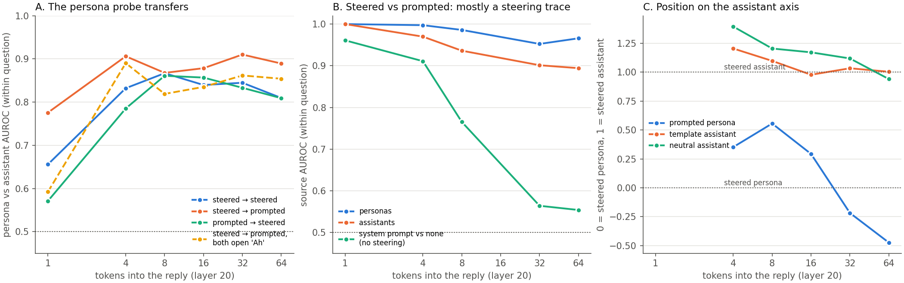

# Phase 6 — Is a system-prompted persona represented like a steered one?

**Run 2026-10-05, Colab RTX PRO 6000 Blackwell (96 GB), bf16, torch 2.13 (cu130), transformers 5.18, vLLM 0.29.0.
Qwen3-8B, thinking off. Judge: Gemma 4 31B, same rubric as phase 3.**

## The question

Phase 3 made Qwen3-8B speak as characters by adding one direction at layer 0 ("steered" below). Gemma labelled
each character ("sea captain", "noir detective", "storyteller"). Here we ask: is a steered sea captain the same
thing inside the model as a sea captain we get just by asking for one in a system prompt?

## Short answer

**Mostly yes at the level of "a character is speaking" and "which kind of character". Not yet at the level of the
exact character. The big difference we first saw between the two sources is mostly a trace of the steering
itself, not a different way of building the persona.**

- **The persona probe transfers both ways.** A persona-vs-assistant direction learned only on steered replies
  separates prompted personas from prompted assistants at AUROC **0.91** after 4 reply tokens and **0.87–0.91**
  after that. A direction learned only on prompted replies scores **0.86** on steered replies after 8 tokens, the
  same as a probe trained on steered replies (0.87). The two directions have cosine **0.47** after 4 tokens and
  **0.74** after 32–64 tokens: they converge as the reply goes on.
- **The transfer is not the "Ah" opener.** 73 % of prompted personas start with "Ah"; no steered persona does.
  Comparing only replies that *both* open with "Ah", the steered probe still scores **0.82–0.89**.
- **The same kind of character lines up across sources.** After 8 tokens, the steered centroid of a character
  family (detective, chef, poet, ...) finds its own prompted family among 11 at **73–82 %** (chance 9 %, shuffle
  null at most 23 %). For single labels ("sea captain" among 48 labels with ≥ 20 rows each) the hit rate is only
  **9–25 %** (chance 2 %, null ≤ 9 %), against a same-source ceiling of 33–49 %.
- **The main axes of variation among personas converge too.** The top-10 persona-only PCA subspaces of the two
  sources share little after 4 tokens (mean principal-angle cosine **0.39**; same-source halves 0.96) and nearly
  coincide after 64 tokens (**0.87**).
- **The two sources stay linearly separable** (AUROC **0.95–0.99** at every reply position). But **assistant
  replies separate almost as well** (0.89–0.97): a steered assistant is as easy to tell from a prompted assistant
  as a steered persona is from a prompted persona. A plain system prompt with no steering leaves a trace that
  fades to near chance (0.56) by 32 tokens. So the separable "source" is mostly **the layer-0 push still being
  readable in the reply**, not a second persona mechanism.

## What we ran

**Rollouts (9,381, no steering anywhere).** For **every one of the 6,821 steered persona replies** from phase 3
(the same selection as every phase 3 analysis: `probe_l0` arm, no word salad, persona in both judge passes,
thinking-aloud labels dropped), one new rollout with the **same question** and a system prompt built from that
reply's pass-1 Gemma label. This covers all 2,367 distinct labels and gives a matched pair per row. Two control
arms, 40 questions × 32 seeds each:

| arm | system prompt | n |
|---|---|---|
| `prompted` | `You are playing a character described as "<label>". Answer the user fully in this character's voice and stay in character for the whole reply.` | 6,821 |
| `template_assistant` | the same template with the label `helpful AI assistant` | 1,280 |
| `neutral` | `You are a helpful assistant.` | 1,280 |

⚠ The suggested template was "You are a sea captain." We changed it because many labels are registers, not roles
("gen z slang", "first person narrative", "dry wit"), and "You are a gen z slang" reads badly. One template for
all labels means the system prompt differs between rows only in the label. The `template_assistant` arm is the
tightest control: same template, same length, but the "character" is the default assistant.

Sampling as phase 3: temperature 1.0, top_p 1.0, 96 new tokens, thinking off, vLLM. The no-system-prompt
baseline is phase 3's clean arm (320 rollouts). Gate: the clean first-token entropy on "what shall i do today"
gave **0.220** bits against phase 3's 0.237 (tolerance 0.02, passed; this GPU/torch build differs from phase 3's).

**Activations.** Teacher-forced, HF transformers, bf16: layers 0, 4, …, 36 at slots P (last prompt token) and
R1–R8 (the position that has seen k reply tokens), plus layer 20 at R4, R8, R12, R16, R24, R32, R48, R64. Same
layout and conventions as phase 3 (`hidden_states[L]` = residual after block L; 36 is after the final norm).

**⚠ Both sources were captured on the same machine.** We also re-captured all 8,605 phase 3 rows we compare
against (6,821 steered personas, 1,464 steered assistants, 320 clean), with the phase 3 layer-0 hook on for the
steered rows. All comparisons below use these re-captured steered features, so no source difference can come from
a different GPU, library or batch.

Why: our first gate demanded cosine > 0.999 against phase 3's stored features at every layer and slot, and it
**failed** (min 0.994 at layer 36, mean 0.9997). A diagnostic showed this is ordinary bf16 noise: **the same rig
compared with itself** (rows one at a time vs in a batch of 32) disagrees by as much (min 0.988 at layer 36). The
final gate passes if (a) layer 0 matches exactly (min cos 1.000, i.e. the hook is right), (b) the late slots
match (min 0.9993), and (c) at every layer the new-vs-stored agreement is at least as good as same-rig batching
noise (it is, at all 10 layers). Re-captured vs stored at L20 R4 over 200 random rows: min 0.998, mean 0.9998.
Logs: `results/run_all_try1_gate_failed.log`, `results/run_all.log`.

**Judging.** Gemma 4 31B (bf16) with phase 3's rubric, extracted word for word from phase 3's script
(`results/rubric.txt`). Two blind passes (temperature 0 and 0.7); the judge sees the user message and the reply,
never the system prompt. **0 unparseable**, κ between passes 0.993 (a stability measure, as in phase 3). A third,
**non-blind** pass asks "is this reply in the voice of `<label>`?" (2 clearly / 1 partly / 0 no).

**Analysis** (local CPU): leave-questions-out everywhere (10 folds over the 40 questions; a probe never sees its
test questions in either source), and **within-question AUROC** (phase 3's metric that cannot inherit the
question). Code: `code/analyze.py`, `code/judge_stats.py`, `code/make_figure.py`.

## 1. Did the system prompts produce the asked-for persona?

| arm | persona (strict, both passes) | default assistant | coherent (2, both) | English |
|---|---|---|---|---|
| steered (phase 3) | 66.6 % | — | — | 93 % |
| `prompted` | **88.1 %** | 11.2 % | 92.4 % | 99.9 % |
| `template_assistant` | 7.0 % | 92.7 % | 92.9 % | 99.9 % |
| `neutral` | 0.0 % | 100 % | 92.3 % | 100 % |

**Does the reply match the persona that was asked for?** The judge's blind pass-1 label vs the requested label:

| measure | prompted |
|---|---|
| exact same label | 14.8 % (16.8 % of rows judged persona) |
| share a content word | 47.8 % (54.2 %), against a within-question shuffle null of 12.5 % |
| same family (rows where both labels fall in a family) | 61.4 % (n = 4,204) |
| for reference: steered pass 1 vs pass 2, same reply | 69.8 % exact, 82.5 % shared word |

The non-blind match pass:

| reply judged against | clearly | partly | no |
|---|---|---|---|
| the label asked for (prompted) | **89.7 %** | 4.7 % | 5.6 % |
| its own label (steered, a ceiling) | 83.6 % | 9.0 % | 7.4 % |
| a random label from another family (false positives) | 26.8 % | 17.7 % | 55.5 % |

⁂ The prompted replies are the asked-for persona about as often as the steered replies fit their own label. But
Gemma's blind labels are loose: the same prompted reply often gets a near-synonym ("whimsical storyteller" for a
requested "storyteller"), and a mismatched label is called "clearly" a match 27 % of the time. Exact-label
agreement is therefore a poor yardstick; family and the match pass are the useful ones.

⚠ The prompted arm is less diverse in the judge's eyes. The top blind labels are "whimsical storyteller" (446),
"storyteller" (307), "mystical guide" (178): the model leans to a few house styles. Requested families with the
lowest persona rate: poet (70 %), casual (74 %), mentor (77 %), where the model often just answers helpfully.

## 2. Does the persona probe transfer between sources?

Mass-mean direction (persona mean minus assistant mean), leave-questions-out, within-question macro AUROC
(pooled in brackets). Negatives on the prompted side are `template_assistant` replies judged default assistant
(n = 1,187); positives are prompted replies judged persona (n = 6,008).

| cell | steered → steered | steered → prompted | prompted → steered | prompted → prompted | cos(directions) |
|---|---|---|---|---|---|
| L20 P | 0.51 | 0.84 | 0.52 | 1.00 | 0.04 |
| L20 R1 | 0.66 | 0.78 | 0.57 | 0.94 | 0.10 |
| L20 R4 | 0.83 (0.87) | **0.91** (0.88) | 0.79 | 0.93 | 0.47 |
| L20 R8 | 0.87 (0.89) | 0.87 (0.85) | **0.86** (0.86) | 0.93 | 0.54 |
| L20 R16 | 0.84 | 0.88 | 0.86 | 0.94 | 0.64 |
| L20 R32 | 0.85 | 0.91 | 0.83 | 0.94 | 0.73 |
| L20 R64 | 0.81 | 0.89 | 0.81 | 0.91 | 0.74 |
| L8 R4 | 0.78 | 0.80 | 0.67 | 0.89 | 0.36 |
| L32 R8 | 0.86 | 0.95 | 0.76 | 0.95 | 0.43 |

With `neutral` assistants as negatives, steered → prompted is higher still (0.94 at L20 R4–R8, 0.97 at R32);
`template_assistant` is the stricter control and is the one quoted.

⁂ **From 4 reply tokens on, the steered persona direction reads prompted personas as well as it reads steered
ones**, and from 8 tokens the reverse holds too. The directions themselves get closer as the reply goes on
(cosine 0.47 → 0.74). At slot P (before the reply) nothing transfers: there, the steered "persona" state is just
the push, and the prompted one is the system prompt text.

**Opener control.** 73 % of prompted personas open with "Ah" (13 % "Oh"); steered personas open with stage
directions (" Suddenly" 10 %, " smoking" 9 %) and never with "Ah". 34 % of template assistants also open with
"Ah". Inside one opener, so the first word cannot separate the classes:

| L20 | both open "Ah" (4,359 vs 383 rows, 24 questions) | both open with neither "Ah" nor "Oh" (876 vs 781, 34 questions) |
|---|---|---|
| R1 | 0.59 | 0.86 |
| R4 | **0.89** | 0.94 |
| R8 | 0.82 | 0.86 |
| R16 | 0.84 | 0.92 |
| R32 | 0.86 | 0.92 |
| R64 | 0.85 | 0.91 |

⁂ At R1 the "Ah" rows sit on literally the same token, and the steered probe barely separates them (0.59). Three
tokens later it does (0.89). The transfer is not an "Ah" detector.

## 3. Same character, different source

For each label (and each family), the question-demeaned mean state of the steered rows and of their prompted
twins (same question, same label by construction). Each steered centroid is matched to the nearest prompted
centroid by cosine, and vice versa. Null: labels shuffled within each question on the prompted side (200
permutations). Ceiling: the steered rows split into two random halves and matched to each other.

| cell | families (K = 11): s→p / p→s | null mean / 95 % | ceiling | labels n ≥ 20 (K = 48): s→p / p→s | null 95 % | ceiling |
|---|---|---|---|---|---|---|
| L20 P | 0.09 / 0.09 | 0.11 / 0.23 | 0.23 | 0.02 / 0.00 | 0.04 | 0.12 |
| L20 R1 | 0.36 / 0.36 | 0.13 / 0.23 | 0.68 | 0.08 / 0.08 | 0.06 | 0.38 |
| L20 R4 | 0.45 / 0.45 | 0.11 / 0.27 | 0.91 | 0.12 / 0.12 | 0.06 | 0.49 |
| **L20 R8** | **0.73 / 0.82** | 0.11 / 0.23 | 0.91 | 0.10 / 0.15 | 0.07 | 0.39 |
| L20 R16 | 0.82 / 0.64 | 0.12 / 0.27 | 0.86 | 0.25 / 0.12 | 0.08 | 0.39 |
| L20 R32 | 0.73 / 0.45 | 0.13 / 0.27 | 0.59 | 0.17 / 0.17 | 0.09 | 0.33 |
| L20 R64 | 0.64 / 0.55 | 0.11 / 0.27 | 0.45 | 0.19 / 0.09 | 0.09 | 0.20 |
| L8 R8 | 0.45 / 0.18 | 0.12 / 0.27 | 0.95 | 0.04 / 0.04 | 0.06 | 0.36 |
| L32 R8 | **0.91** / 0.64 | 0.12 / 0.28 | 0.82 | 0.19 / 0.19 | 0.07 | 0.35 |

Labels with n ≥ 10 (K ≈ 100) give the same picture: 0.12–0.15 at L20 R32–R64 against a null 95 % of 0.05 and a
ceiling of 0.13–0.20. Keeping only prompted twins that the match pass calls "clearly" the asked-for persona
changes little (L20 R8 families: 0.73 / 0.82).

⁂ **Character family lines up across sources from 8 tokens on**: 8 in 11 or better at L20 R8, and 5–9 in 11
after that, always above the shuffle null's 95th percentile. **Exact labels line up only weakly**: 9–25 % at K = 48, above the null (p ≤ 0.01 at
every reply slot from R4) but well below the same-source ceiling at R4–R16. By R64 the label-level match nearly
reaches the ceiling, but the ceiling itself has fallen to 0.20, so this is a weak signal for both sources.

⚠ The ceiling uses half the steered rows per centroid, so it is a little pessimistic; that is why the family match
can exceed it at R32–R64. Matched-centroid cosines are small (0.27 at L20 R8 for families, 0.11 for labels;
unmatched ≈ 0): a character's own direction is a small part of the state once the question is removed.

## 4. Where do prompted personas sit on the assistant axis?

Projection on phase 1's `assistant_axis_l20` (`demo/directions.npz`; + = toward the assistant), rescaled so
**0 = steered persona mean and 1 = steered assistant mean** at each slot.

| L20 | steered persona | steered assistant | clean (no system prompt) | prompted persona (judged) | template assistant | neutral assistant |
|---|---|---|---|---|---|---|
| P | 0 (−81.2) | 1 (−77.2) | 20.5 | 19.1 | 19.5 | 20.4 |
| R1 | 0 (−4.1) | 1 (−2.7) | 3.7 | **−5.6** (−12.3) | −0.6 | 3.6 |
| R4 | 0 (−6.9) | 1 (−1.8) | 1.4 | 0.35 | 1.2 | 1.4 |
| R8 | 0 | 1 | 1.2 | 0.56 | 1.1 | 1.2 |
| R16 | 0 | 1 | 1.2 | 0.29 | 1.0 | 1.2 |
| R32 | 0 | 1 | 1.2 | −0.22 | 1.0 | 1.1 |
| R64 | 0 | 1 | 0.9 | −0.47 | 1.0 | 0.9 |

⁂ **The two sources take different paths off the assistant axis.** Steering moves the *prompt* positions far off
the axis (−81, for persona and assistant rollouts alike); a system prompt does not move them at all (the prompted
P state sits with the clean and neutral ones). At the first reply token the prompted persona state jumps much
further off the axis than any steered state (−12.3 vs −4.1). Over 4–16 tokens prompted personas sit between steered
personas and assistants, and by 32–64 tokens they are further from the assistant than steered personas are.

## 5. Joint PCA and the source signal

**Joint PCA** of the 6,821 steered + 6,821 prompted persona rows (question means removed over both sources
together, so the source offset is kept), and **persona-only PCA** of each source on its own (question means
removed per source).

| cell | source AUROC (linear, lq-out) | source offset share of variance | PC1 source AUROC | top-10 subspace: mean principal cos, steered vs prompted | same-source halves | participation ratio, steered / prompted |
|---|---|---|---|---|---|---|
| L20 R4 | 0.997 | 7.9 % | 0.994 | 0.39 | 0.97 / 0.96 | 95 / **33** |
| L20 R8 | 0.986 | 5.1 % | 0.978 | 0.54 | 0.98 / 0.92 | 96 / 89 |
| L20 R32 | 0.964 | 1.1 % | 0.57 | 0.78 | 0.97 / 0.92 | 139 / 150 |
| L20 R64 | 0.967 | 0.6 % | 0.55 | **0.87** | 0.96 / 0.96 | 190 / 185 |
| L32 R8 | 0.982 | 3.8 % | 0.87 | 0.43 | 0.97 / 0.98 | 84 / 84 |

(Random 10-dim subspaces: mean principal cos 0.04.) At L20 R64 the steered top-10 subspace captures 15.8 % of the
prompted variance, against 17.7 % for the prompted set's own top 10.

⁂ **Early in the reply the two sources look different; later they look alike.** After 4 tokens the source is PC1,
prompted personas are three times lower-dimensional (participation ratio 33 vs 95, very likely the shared "Ah, …"
opening squeezing them together), and the persona subspaces barely overlap. By 32–64 tokens the source offset is
about 1 % of the variance, it is on no top component, the dimensionalities match, and the leading persona axes of
the two sources nearly coincide. At layer 20, family explains little of any component in either source (η² ≤ 0.06 from R8 on), as phase 3
found for steered personas alone. At L32 R8 it is somewhat higher for prompted personas (up to 0.16).

**Is the source signal about the persona?** Source decoding at matched n (1,187 per side), within-question AUROC:

| L20 | steered vs prompted **personas** | steered vs template **assistants** | steered vs neutral assistants | clean vs neutral (system prompt only, no steering) |
|---|---|---|---|---|
| P | 1.000 | 1.000 | 1.000 | 1.000 |
| R1 | 1.000 | 1.000 | 0.998 | 0.961 |
| R4 | 0.997 | 0.970 | 0.955 | 0.911 |
| R8 | 0.986 | 0.936 | 0.942 | 0.765 |
| R32 | 0.952 | 0.901 | 0.912 | 0.564 |
| R64 | 0.966 | 0.894 | 0.857 | 0.554 |

(L32 R8: 0.980 vs 0.970; L8 R8: 0.947 vs 0.880.)

⁂ **Assistants separate by source almost as well as personas do**, so most of the source signal does not need a
persona. And it is the **steering**, not the system prompt, that leaves the lasting trace: a system prompt with no
steering is near chance by 32 tokens, while anything steered stays ~0.9 decodable. The layer-0 push on the prompt
positions stays readable through the whole reply. Being a persona adds only 0.03–0.07 AUROC on top.

## Reading

The tempting reading of the joint PCA, "two distinct mechanisms for putting the model in a persona", does not
survive the assistant control. What the data support instead:

1. **One shared "a character is speaking" direction**, reached from both sources. Probes transfer at about the
   within-source level, both ways, with the opener held fixed, and the two directions converge (cos 0.74).
2. **Shared character-family structure.** Family centroids match across sources at 73–82 % at L20 R8 (64–91 %
   at L32 R8, 45–82 % at L20 R16–R64; chance 9 %, null 95 % ≤ 28 %).
   Exact characters match only weakly, which is also true *within* one source (ceiling 0.20–0.49).
3. **Two different entry routes.** Steering acts on the prompt positions and leaves a lasting, persona-independent
   trace; a system prompt leaves the prompt state alone and makes its move at the first reply token, with a
   stereotyped "Ah, …" opening. These differences are large early in the reply and fade by 32–64 tokens.

## Caveats

- **One template.** All prompted personas come from one system-prompt wording. A different wording ("You are a
  ...", or the label in the user turn) could give different openers and a different early-reply picture.
- **Labels are Gemma's, and loose.** The requested label is the steered reply's pass-1 label; Gemma relabels the
  prompted reply with the exact same words only 15 % of the time (its own two passes agree 70 % on one reply). Part
  of the weak label-level match is label noise, not representation.
- **The prompted arm is more stereotyped.** The model favours a few house styles ("whimsical storyteller",
  "mystical guide"), and it answers plainly for 11 % of requests. We used all prompted rows for the matching
  analysis and only judged personas for the probes.
- **Mass-mean probes only**, as in phase 3. A logistic probe could read more, in either source.
- **Family regex** is phase 3's; 30 % of steered personas are unlabelled at family level.
- **Rig.** Generation on this GPU/torch build gave a first-token entropy 0.017 bits below phase 3's (within
  tolerance). The steered rollouts themselves are phase 3's, not regenerated.
- **Not tested here:** behaviour. Whether a prompted persona changes refusal the way the steered direction does
  (phase 4) was not run.

## Files

- `code/`: `build_requests.py` (requests and gate rows), `make_rubric.py`, `job_gen_vllm.py`, `job_capture_hf.py`,
  `job_judge_vllm.py`, `run_all.sh` (the VM pipeline), `common.py` and `data.py` (selection and loading),
  `analyze.py` (sections `transfer`, `match`, `axis`, `pca`, `openers`, `srcctl`, `openerctl`), `judge_stats.py`,
  `make_figure.py`.
- `results/`: `requests.jsonl`, `steered_match.jsonl`, `gate_rows.json`, `steered_capture_rows.json`,
  `rubric.txt`, `probe_l0_direction.json` (copy of phase 3's), `judge_stats.json`, `analysis.json` (transfer,
  match, axis, pca, openers), `analysis_controls.json` (srcctl, openerctl), `analyze*.log`, `run_all*.log`.
- `figures/phase6_summary.png`.
- **Hugging Face:** `mild-rgb/phase6-system-prompt-personas-qwen3-8b`. `gen.jsonl` (all 9,381
  rollouts), `features/` (phase 6 activations, 7.1 GB), `features_steered/` (phase 3 rows re-captured on the same
  rig, 6.5 GB), `judge/` (`judge_p1.json`, `judge_p2.json`, `judge_match.json`), `inputs/`. Local copy in
  `results/hf_dl/` (activations git-ignored).
